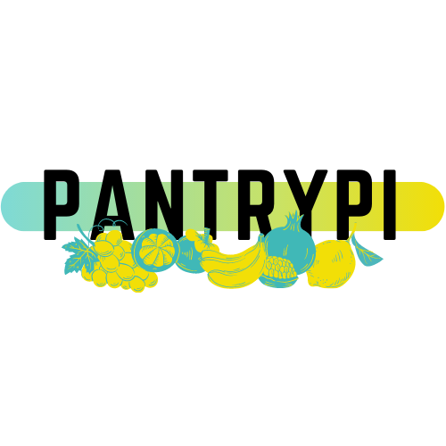

<!--
*** Thanks for checking out the Best-README-Template. If you have a suggestion
*** that would make this better, please fork the repo and create a pull request
*** or simply open an issue with the tag "enhancement".
*** Thanks again! Now go create something AMAZING! :D
***
***
***
*** To avoid retyping too much info. Do a search and replace for the following:
*** github_username, repo_name, twitter_handle, email, project_title, project_description
-->

<!-- PROJECT LOGO -->
<br />
<p align="center">
  <a href="https://github.com/MissPeperr/PantryPi-Client">
    
  </a>

  <h3 align="center">PantryPi</h3>

  <p align="center">
    PantryPi allows me to view the food products in my pantry! I was tired of getting to the grocery store and realizing I forgot to check if we had x at home, so I'm building out a full-stack app for my specific pantry.
  </p>
</p>

### Built With

* [React.js](https://reactjs.org/)
* [Grommet](https://v2.grommet.io/grommet)

<!-- GETTING STARTED -->
## Getting Started

To get a local copy up and running follow these steps:

### Prerequisites

* A Barcode Scanner
* npm
* Setup the [PantryPi Server](https://github.com/MissPeperr/PantryPi-Server)

### Installation

1. Clone the repo
    ```sh
   git clone https://github.com/MissPeperr/PantryPi-Client.git
   ```
1. Install packages through npm
   ```sh
   npm install
   ```
1. Run react server with:
    ```sh
    npm start
    ```